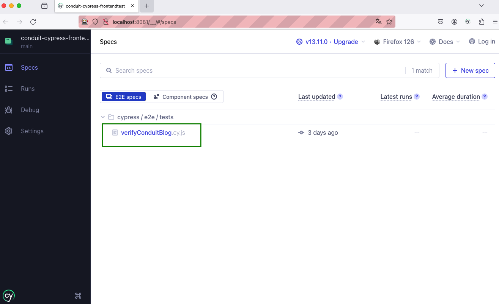

# conduit-cypress-frontendtest

👋 Hello!

# Project description
This project aims to explore the project vue-realworld-example-app(https://github.com/CaiqueCoelho/vue-realworld-example-app) by running the most important cases
from each critical flow below:
- Access / click on an article;
- Post an article;
- Creating an account;

# Language, framework and technologies used
Cypress framework was used in this project, and the test cases were created using the JavaScript language, in conjunction with the Page Objects project pattern.

To generate user data, we used the API obtained from https://randomuser.me/.

To integrate the project on a CI/CD pipeline it was used Jenkins.

# Test Cases:

The following test cases were created to cover the main funcionalities:

- Verify user can access an article on Homepage;
- Verify user can create an account;
- Verify user can post an article;

# Test Results:
As there are some bugs on the Vue Conduit application, the expected test results are:

- Verify user can access an article on Homepage: passed ✅;
- Verify user can create an account: passed ✅;
- Verify user can post an article: failed ❌
    - The application does not allow the user to post an article. 


# How to install and check the project?

1. **Run the Vue RealWorld Application localy**: follor the instructions on https://github.com/CaiqueCoelho/vue-realworld-example-app


2. **Install Cypress**: 
After git clone this project to your local machine (https://github.com/abmaelrodrigo/conduit-cypress-frontendtest.git), access the project directory and run the following command: 
```bash
npm install cypress --save-dev
```

3. **Open Cypress on UI mode**: 
```bash
npx cypress open
```

4. **On the Welcome page**:  click on 'E2E Testing'


5. **Choose a browser**, and click on Start 'E2E Testing'


6. **Click on the test case**: the tests will start automatically




### You can also run the project on a headless mode: 
In the command below, we can run the project on Firefox browser

```bash
npx cypress run --browser firefox 
```

# How to create a pipeline on Jenkins?

1. To integrate this project to Jenkis, you will need to Fork it to your repository, since you will need your github credentials on Jenkins.

2. After opening Jenkins, create a Pipeline project:


3. On Pipeline definitions, enter the project URL and your Github credentials:


4. On Script Path, enter Jenkinsfile and save:


5. Before running the project, make sure the Vue Conduit project is running locally

6. On the Jenkins Dashboard, access the project you just created and click on Build Now - the build will start automatically.


## **Important**: 
Make sure the NodeJS plugin installed on your Jenkins is configured as a global variable. Inside the Jenkinsfile on this project, the variable is called Node21. Make sure to rename it according to the nome you used to set up your global variable. 